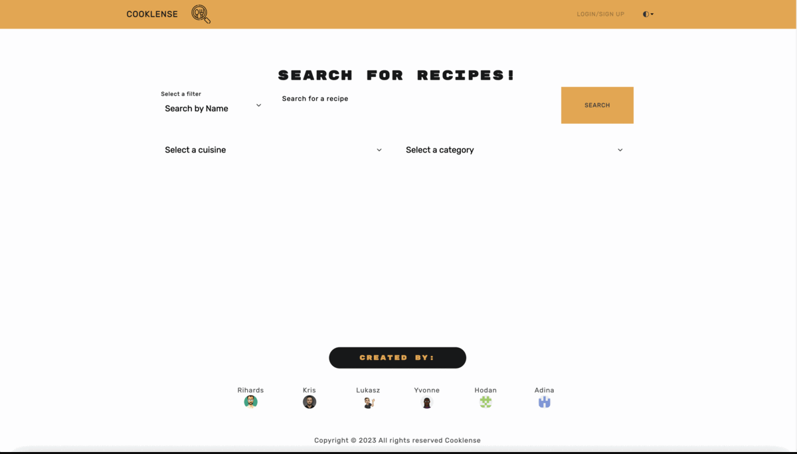

[](https://choosealicense.com/licenses/mit)


#



#

## Table of Contents

- [Description](#description)
- [Technologies Used](#technologies-used)
- [Installation](#installation)
- [Usage](#usage)
- [Link](#link)
- [How to Contribute](#how-to-contribute)
- [Authors](#authors)
- [License](#license)

#

#

## Description

This application allows users to look for meals based on different regions, giving them the chance to experience the rich diversity of global cuisine. Users can look up recipes using keywords and ingredients. The software will provide users with a list of recipes as well as a list of required ingredients and preparation instructions. Users can set up multiple accounts and keep their favorite recipes there so they can access them later by reopening the app. Users can also create and delete accounts as needed. Users can also examine the calories in their planned meals and schedule meals for up to a week. Additionally, they can add or remove shopping to-do lists.

#

## Technologies Used

Node.js, Express, React, Redux, Apollo Server,
Graphql, Mongodb, Mongoose, Heroku, JWT, Stripe, ReactBootstrap

## Installation

You can clone the git repository and run next command to use tha web application locally

Install all dependencies

```
  npm install
```

```
  npm run build
```

```
  npm run develope
```

#

## Usage

In order to use the program you will need to clone the repository from GitHub provided in the link below.

#

## How to Contribute

For and suggestions or contributions you can reach me at my email address or you can clone to code and edit it the way it will suite you the best.

#

## Link

Link to repository:

https://github.com/kristiyantefov/cooklense

Link to website:

https://cooklense-6466eecac055.herokuapp.com/

#

## Authors

- [Kristiyan](https://github.com/kristiyantefov)

- [Rihards](https://github.com/dexit)

- [Lukasz](https://github.com/Abstynent)

- [Yvonne](https://github.com/SalmY001)

- [Hodan](https://github.com/Ze7Hu)

- [Adina](https://github.com/Adinahidan)

#

## License

- This application is covered under: [MIT License](https://choosealicense.com/licenses/mit)
